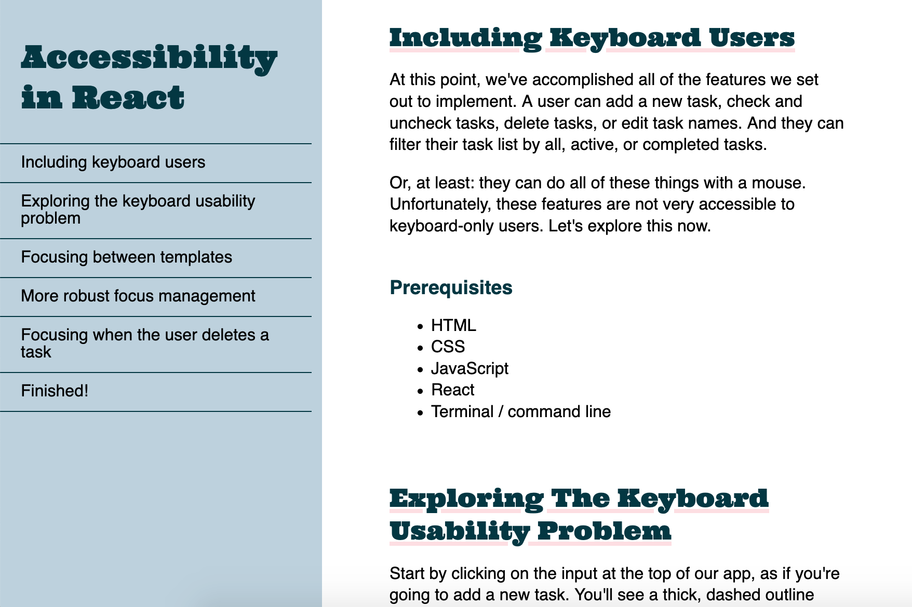

As part of the freeCodeCamp Responsive Web Design certification, the task was to create a responsive documentation page in simple HTML. As I was also studying React at the time, I decided to take the contents from a React docs page from MDN.

I used this as an exercise in Sass, to continue learning from my [previous project](/projects/homegrown-landing-page/). I also had fun choosing the typography and designing the overall look of the page!

[See it live on CodePen](https://codepen.io/marcovidonis/full/rNORQGV).

- HTML
- Sass
