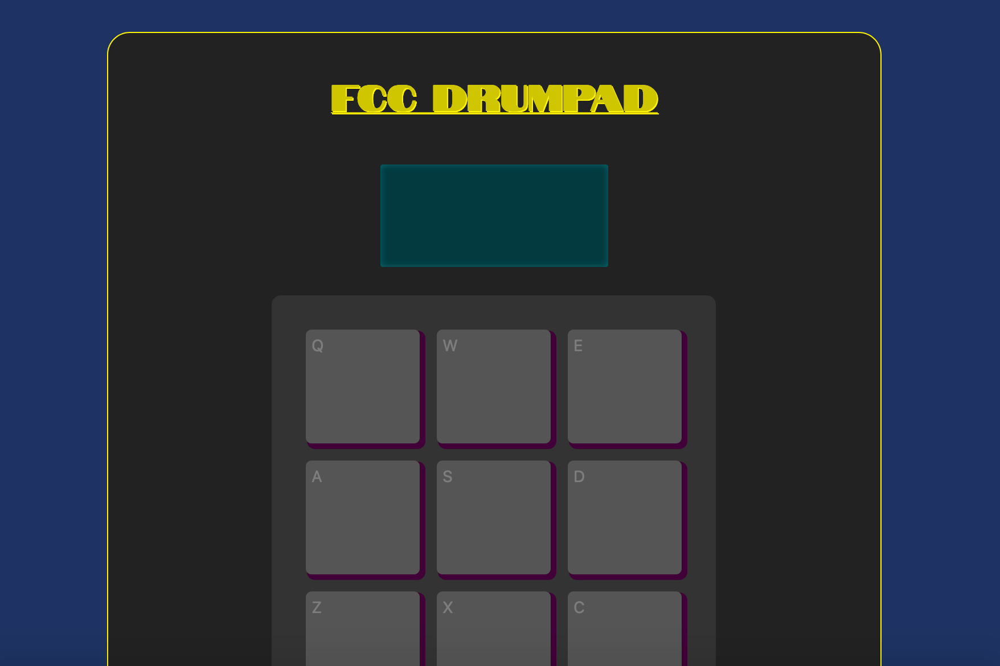

I had tons of fun creating this drum machine app with React!

The main challenge for me was to make the buttons behave exactly how I wanted them to: the sound should play in loop for as long as you keep the button pressed, and stop as soon as you lift your finger.

I had fun designing the screen, with a dot-matrix LCD effect, and the push buttons that light up when they're pressed.

[See it live on CodePen](https://codepen.io/marcovidonis/full/JjGjagY).

- React
- HTML
- Sass
