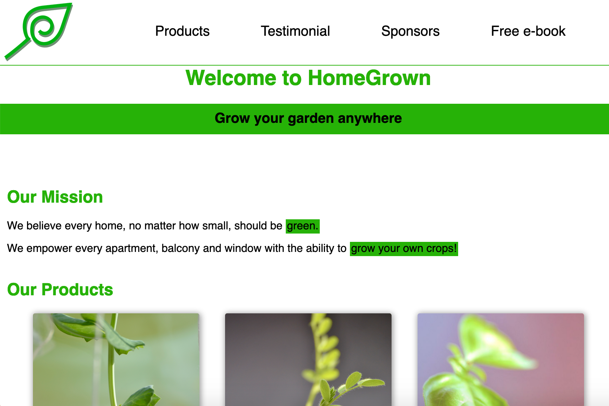

The task here was to create a mock product landing page in simple HTML. I took inspiration from the plants we started growing in our tiny apartment during the first lockdown. The photos in the website show our basil, pea and lentil plants!

I also used this as an opportunity to experiment with Sass. I found it quite useful, as I think it can help make my CSS more organised and easier to read.

[See it live on CodePen](https://codepen.io/marcovidonis/full/rNOvaLj).

- HTML
- Sass
