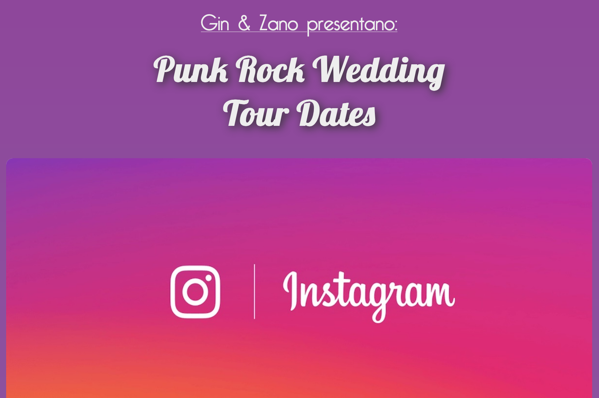

See the [live website](https://punkrockwedding.github.io/tourdates/) or the [Github repo](https://github.com/marcovidonis/tourdates).

This project is particularly dear to me, as it's the website I made for my sister's wedding. The main page lists their honeymoon destinations: Each place has a card showing a picture and a brief description on mouse hover.

On the day, the website also included an Instagram page, which was a web scraper that showed the guests a live feed of all the pictures posted on Instagram with the wedding's hashtag, #GinZano2018.

The idea behind the project was that all guests during the day could contribute to the site by tagging their photos on Instagram, and see the photobook of the day take shape in real time!

- CSS Grid
- AJAX
- jQuery
- Google Analytics
