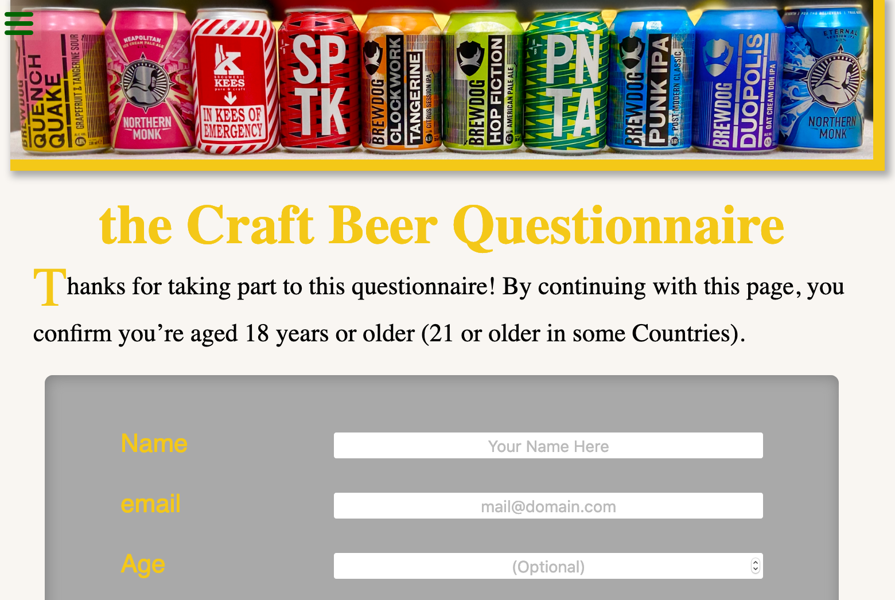

As part of the freeCodeCamp curriculum, the task here was to build a survey form. Not the most exciting task, but I want it to make it a little bit more fun.

When I moved to Leeds, I was blown away by the craft beer scene, the variety of beer styles and the exceptional flavours! Of course I had to make my survey about that...

Also, I'm quite proud of my "cans rainbow" picture ;)

[See it live on CodePen](https://codepen.io/marcovidonis/full/jObbBMd).

- HTML
- CSS
