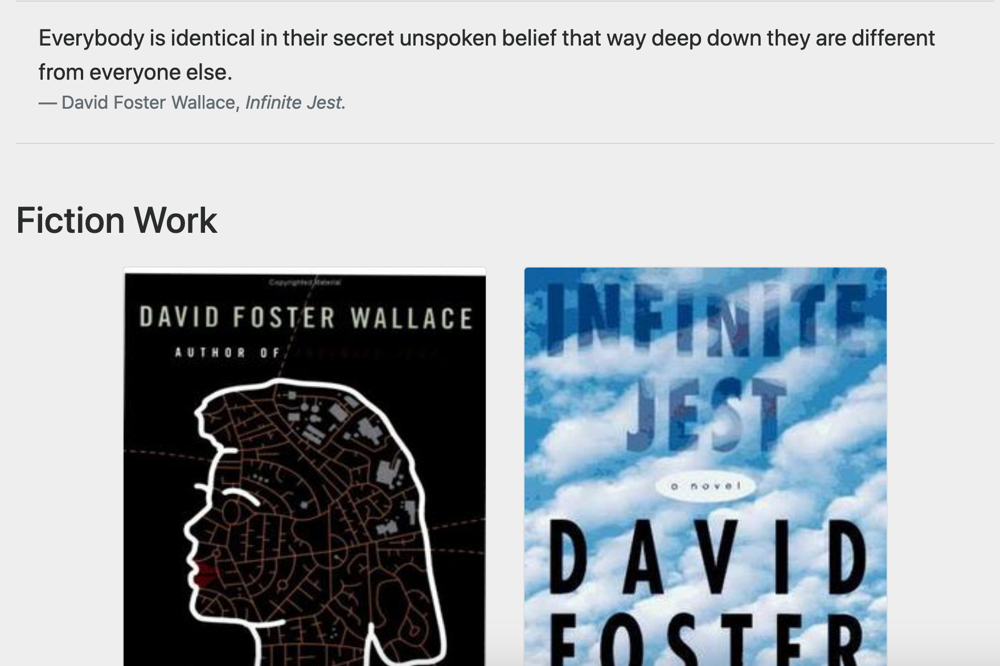

My very first project as a web developer, and the first for freeCodeCamp's curriculum.

I had fun getting my hands dirty! I experimented with Bootstrap, but I soon found it a bit counter-intuitive. The HTML can get quite complex even with simple pages.
In my following projects I moved to simple CSS for the design and started appreciating the concept of Separation of Concerns.

[See it live on CodePen](https://codepen.io/marcovidonis/full/brRBNY/).

- HTML
- Bootstrap
